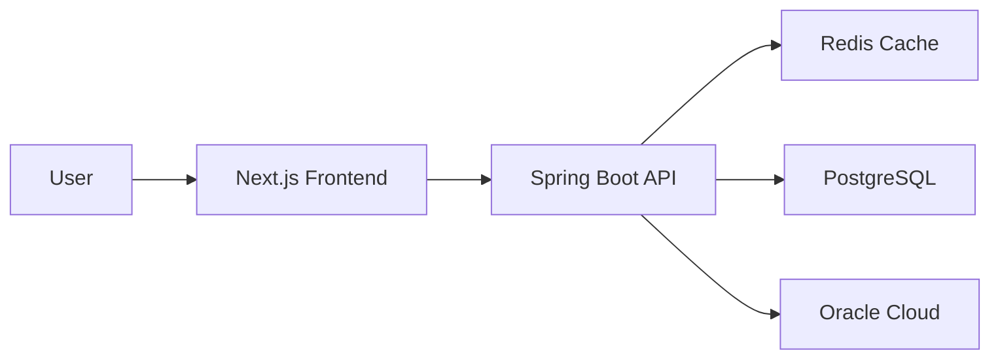
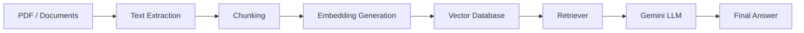

<h1 align="center">
  Hi 👋 I'm Sidhant Kumar
</h1>

<h3 align="center">
Backend Engineer • Full Stack Developer • AI Systems Builder
</h3>

<p align="center">
Building scalable backend systems, cloud infrastructure and AI-powered applications.
</p>


<p align="center">

</p>


<p align="center">

</p>


---

<table>
<tr>

<td width="55%">

## 👨‍💻 About Me

🎓 B.Tech Computer Science Engineering  
Techno India University

🎓 B.S Data Science and Applications  
Indian Institute of Technology Madras


💻 Backend-focused Software Engineer

☁ Cloud & DevOps enthusiast

🤖 Building Generative AI applications

🚀 Interested in:

- Distributed Systems
- Database Optimization
- System Design
- Cloud Infrastructure
- AI Engineering


</td>


<td width="45%">


## 📊 GitHub Analytics


</td>

</tr>
</table>


---

# 🛠 Tech Stack


<p align="center">


</p>


---

<table>
<tr>

<td width="50%">


## Backend Engineering

- Spring Boot
- Flask
- REST APIs
- Hibernate
- SQLAlchemy
- Authentication
- API Design
- Performance Optimization


</td>


<td width="50%">


## Databases & Systems

- PostgreSQL
- Redis
- Database Optimization
- Query Optimization
- Caching Strategies
- Distributed Systems


</td>


</tr>
</table>


<table>
<tr>

<td width="50%">


## Cloud & DevOps

- Ubuntu Linux
- Oracle Cloud
- Nginx
- GitHub Actions
- Vercel
- Cloudinary
- CI/CD


</td>


<td width="50%">


## AI Engineering

- LangChain
- Google Gemini
- RAG Systems
- Embeddings
- Vector Databases
- ChromaDB
- Prompt Engineering


</td>


</tr>
</table>


---

# 🚀 Featured Projects


<table>

<tr>

<td width="50%">


## 🚀 BS Connect


Professional networking platform for IIT Madras BS community.


### Tech

Spring Boot  
Next.js  
PostgreSQL  
Redis  
Oracle Cloud


### Highlights

✅ 150+ users

✅ Redis session management

✅ Sub-millisecond cache lookup

✅ N+1 query optimization

✅ Cloudinary image optimization


</td>


<td width="50%">


## 🤖 Enterprise Knowledge Intelligence Assistant


RAG based AI knowledge assistant.


### Tech

Flask

LangChain

Gemini

ChromaDB


### Features

✅ PDF processing pipeline

✅ Semantic search

✅ Vector embeddings

✅ Context-aware answers

✅ Retrieval monitoring


</td>


</tr>

</table>


---

# 🏗 System Architecture



---

# 🧠 More Projects


<table>

<tr>


<td width="50%">


## 🧠 Campus IQ


AI-powered assessment platform.


### Tech

Flask

PostgreSQL

Vue.js

Gemini API


### Features

✅ Multi-tenant architecture

✅ Schema isolation

✅ RBAC authentication

✅ AI quiz generation

✅ Automated evaluation


</td>


<td width="50%">


## 🚗 Vehicle Parking Management System


Smart parking management platform.


### Tech

Flask

Vue.js

Redis

Celery


### Features

✅ JWT authentication

✅ Automated slot allocation

✅ Background workers

✅ Real-time reporting


</td>


</tr>

</table>


---

# 🤖 AI Application Pipeline





---

# 📊 GitHub Statistics


<p align="center">


</p>


<p align="center">


</p>


---

# 📈 Contribution Activity


<p align="center">


</p>


---

# 🐍 Contribution Snake


<p align="center">


</p>


---

# 🏆 GitHub Achievements


<p align="center">


</p>


---

# 🎓 Education


<table>

<tr>

<td>


## Indian Institute of Technology Madras


🎓 Bachelor of Science

Data Science and Applications


📅 2023 - Present


</td>


<td>


## Techno India University


🎓 Bachelor of Technology

Computer Science Engineering


📅 2022 - 2026


</td>


</tr>

</table>


---

# 📚 Relevant Coursework


<table>

<tr>

<td>

### Computer Science

- Data Structures
- Algorithms
- Operating Systems
- Database Management Systems
- System Design


</td>


<td>


### Data Science

- Python Programming
- Statistics
- Machine Learning
- Data Analytics


</td>


</tr>

</table>


---

# 🏅 Certifications


<table>


<tr>

<td>

🏆 HackerRank Problem Solving


</td>


<td>

🏆 HackerRank Python


</td>


</tr>


<tr>

<td>

🏆 HackerRank Java


</td>


<td>

🏆 SQL Advanced


</td>


</tr>


<tr>

<td>

🏆 Software Engineer Certification


</td>


<td>

🏆 Introduction to Cloud Computing


</td>


</tr>


</table>


---

# 🎯 Current Learning Roadmap


```
Backend Engineering

███████████████████░ 95%


System Design

████████████████░░░░ 85%


Distributed Systems

██████████████░░░░░░ 75%


Generative AI

████████████████░░░░ 85%


Docker

████████░░░░░░░░░░░░ 40%


Kubernetes

████░░░░░░░░░░░░░░░░ 20%

```


---

# ⚡ Engineering Interests


<p align="center">


</p>
---

# 💻 Developer Profile


```bash
$ whoami

Sidhant Kumar


$ role

Backend Engineer | Full Stack Developer | AI Builder


$ primary_stack

Java
Python
Spring Boot
Flask
PostgreSQL
Redis


$ currently_building

Scalable APIs

AI-powered systems

Cloud deployments

Distributed architectures

```


---

# 🌐 Coding Profiles


<p align="center">


<a href="https://github.com/23f1001556">


</a>


<a href="https://linkedin.com/in/sidhantkumarsk">


</a>


<a href="https://leetcode.com/">


</a>


<a href="https://www.hackerrank.com/">


</a>


</p>


---

# 📫 Connect With Me


<p align="center">


<a href="mailto:sidhantsksk@gmail.com">


</a>


<a href="https://github.com/23f1001556">


</a>


<a href="https://linkedin.com/in/sidhantkumarsk">


</a>


</p>


---

# 📊 GitHub Metrics


<!--
Enable this using:
https://github.com/lowlighter/metrics

-->

<p align="center">


</p>


---

# 🌟 Featured Repository Goals


<table>


<tr>

<td>


🚀 Build production-grade backend systems


</td>


<td>


🤖 Create practical AI applications


</td>


</tr>


<tr>


<td>


☁ Learn scalable cloud architecture


</td>


<td>


📚 Improve system design skills


</td>


</tr>


</table>


---

# 💡 Engineering Philosophy


<p align="center">


<b>
"Build systems that are simple,
scalable and reliable."
</b>


</p>


---

# ⭐ Support My Work


If you find my projects useful:

⭐ Star the repositories

🐛 Report issues

💡 Suggest improvements


---

<p align="center">


</p>


<h3 align="center">

Thanks for visiting my profile 🚀

</h3>


<p align="center">

Backend • Full Stack • AI • Cloud

</p>
