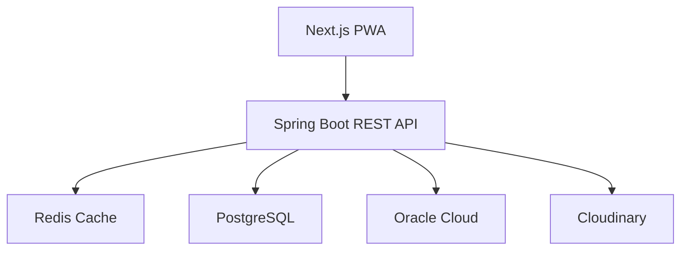

<h1 align="center">Hi 👋, I'm Sidhant Kumar</h1>

<h3 align="center">
Backend Engineer • Full Stack Developer • AI Systems Builder
</h3>

<p align="center">
Building scalable backend systems, distributed architectures, and AI-powered applications.
</p>

<p align="center">

</p>

---

# 👨‍💻 About Me

🎓 **B.Tech CSE** — Techno India University

🎓 **B.S. Data Science & Applications** — IIT Madras

💻 Passionate about

- Backend Engineering
- Full Stack Development
- Distributed Systems
- Database Optimization
- Cloud Infrastructure
- AI Engineering
- Retrieval-Augmented Generation (RAG)

---

# 🚀 Currently Working On

## BS Connect

A professional networking platform built for the IIT Madras BS community.

### Highlights

- ⚡ Spring Boot + Next.js architecture
- 🔐 Google OAuth2 Authentication
- 🚀 Redis Session Store (<1ms lookup)
- 📉 99% database query reduction
- ☁ Oracle Cloud Deployment
- 🌍 Production-grade Nginx Reverse Proxy
- 📦 Cloudinary Image Optimization
- 📱 Progressive Web App

---

## Enterprise Knowledge Intelligence Assistant

RAG-based AI assistant.

### Features

- LangChain
- Gemini
- ChromaDB
- Embeddings
- Semantic Search
- PDF Processing
- Retrieval Monitoring
- Token Usage Analytics

---

## Campus IQ

AI-powered Assessment Platform

- Multi Tenant Architecture
- RBAC
- AI Quiz Generation
- Automated Evaluation
- PostgreSQL
- Flask
- Vue.js

---

# 🏗 Architecture



---

# 🛠 Tech Stack

## Languages

<p>


</p>

---

## Backend

<p>


</p>

Spring Boot • Hibernate • SQLAlchemy • REST APIs

---

## Frontend

<p>


</p>

---

## Databases

<p>


</p>

---

## Cloud & DevOps

<p>


</p>

Oracle Cloud

Cloudinary

Ubuntu

---

## AI

- LangChain
- Google Gemini
- RAG
- Embeddings
- ChromaDB
- Prompt Engineering
- AI-assisted Development

---

# 📈 Featured Projects

## 🚀 BS Connect

Production-ready networking platform

- 150+ Registered Users
- Redis Session Store
- OAuth2 Login
- Spring Boot REST APIs
- Oracle Cloud Deployment
- N+1 Query Optimization
- Cloudinary Integration
- Offline-first PWA

---

## 🤖 Enterprise Knowledge Intelligence Assistant

- LangChain
- Gemini
- ChromaDB
- Flask
- Semantic Search
- Retrieval-Augmented Generation
- Vector Embeddings
- PDF Processing
- Performance Monitoring

---

## 🧠 Campus IQ

- Multi Tenant Architecture
- Role Based Access Control
- AI Quiz Generation
- Automated Evaluation
- PostgreSQL
- Flask
- Vue.js

---

# 📊 GitHub Analytics

<p align="center">


</p>

---

<p align="center">


</p>

---

# 📈 Contribution Graph

> Enable using **Ashutosh00710/github-readme-activity-graph**

```md

```

---

# 🐍 Contribution Snake

Create a GitHub Action using **Platane/snk**

```md

```

---

# 📚 Education

## 🎓 IIT Madras

Bachelor of Science

Data Science and Applications

2023 – Present

---

## 🎓 Techno India University

Bachelor of Technology

Computer Science Engineering

2022 – 2026

---

# 🏆 Certifications

✔ HackerRank Problem Solving

✔ Python

✔ Java

✔ SQL (Advanced)

✔ Software Engineer

✔ Introduction to Cloud Computing

---

# 🎯 Current Learning

```text
Backend Engineering        ████████████████ 95%

System Design              ██████████████   90%

Distributed Systems        ██████████       75%

Generative AI              █████████████    85%

Docker                     ██████           45%

Kubernetes                 ███              25%
```

---

# 🌐 Coding Profiles

<p align="center">

<a href="https://leetcode.com/">

</a>

<a href="https://github.com/23f1001556">

</a>

<a href="https://linkedin.com/in/sidhantkumarsk">

</a>

<a href="https://www.hackerrank.com/">

</a>

</p>

---

# 📫 Connect

📧 **sidhantsksk@gmail.com**

💼 LinkedIn

https://linkedin.com/in/sidhantkumarsk

💻 GitHub

https://github.com/23f1001556

---

<p align="center">

> *"First make it work. Then make it right. Then make it fast."*

</p>

---

<p align="center">

⭐ Thanks for visiting my profile!

If you like my work, consider starring my repositories.

</p>
